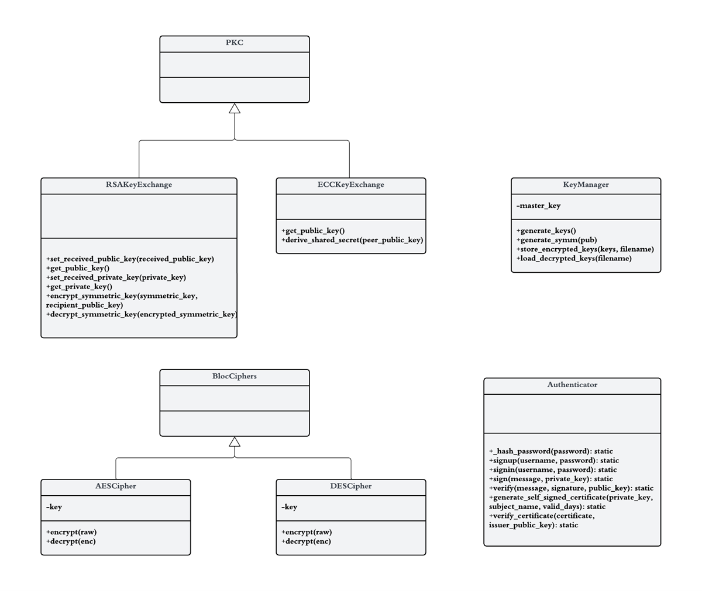
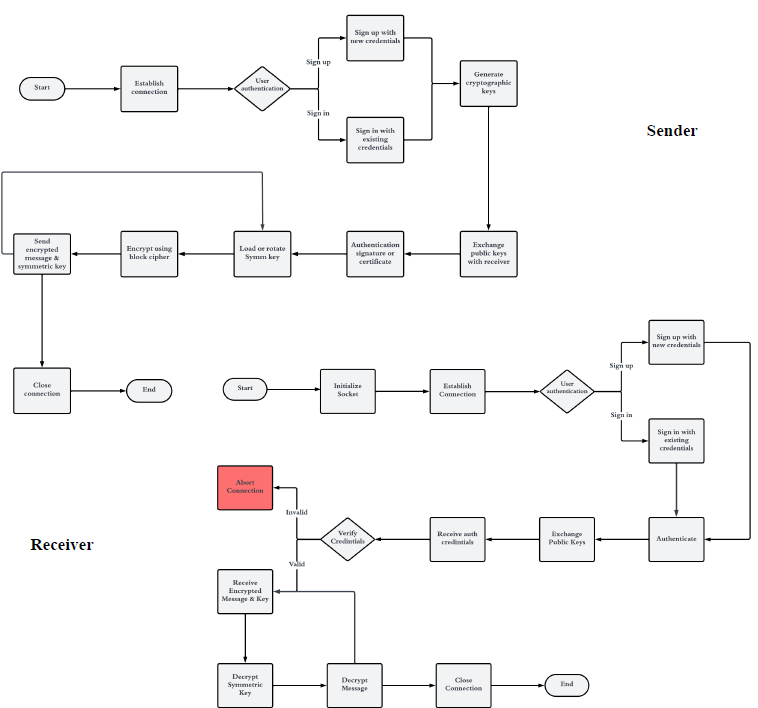
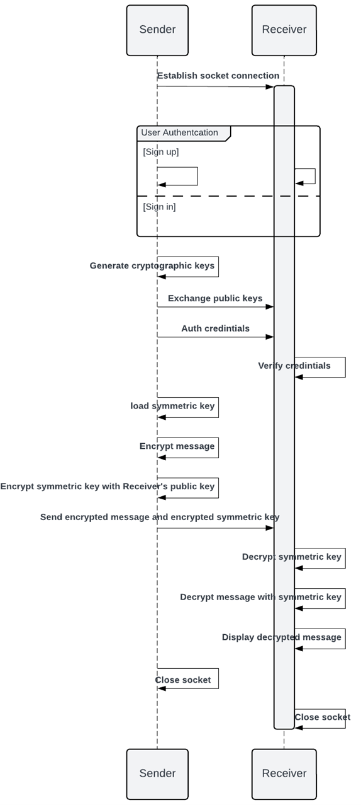

# Secure Communication Suite

This project integrates multiple modules to demonstrate the usage of our system in securing communication between users over the internet. The suite consists of various cryptographic and authentication modules, ensuring safe message transmission between different parties.

## Table of Contents

1. [Introduction](#introduction)
2. [Modules](#modules)
   - [Block Cipher Modules](#block-cipher-modules)
   - [Public Key Cryptosystem (PKC) Module](#public-key-cryptosystem-pkc-module)
   - [Hashing Module](#hashing-module)
   - [Key Management Module](#key-management-module)
   - [Authentication Module](#authentication-module)
3. [Integration and Flow of the System](#integration-and-flow-of-the-system)

## Introduction

Our secure communication suite consists of multiple modules, each containing methods for safe message transmission between users. In this phase, we integrate these modules to demonstrate their usage in securing communication over the internet for various applications.

## Modules

### Block Cipher Modules

In `blockCiphers.py`, we used `pycryptodome` for AES and DES encryption. These modules provide functionalities for encrypting and decrypting data using specific block cipher algorithms, adding robust encryption mechanisms to the overall system.

### Public Key Cryptosystem (PKC) Module

The Public Key Cryptosystem contains:

- **RSAKeyExchange module**: Handles RSA key exchange, encryption, and decryption.
- **ECCKeyExchange module**: Deals with elliptic curve cryptography (ECC) key exchange and shared secret derivation. It accepts a peer's public key, exchanges an elliptic curve Diffie-Hellman (ECDH) key, and generates a shared secret key using HKDF (HMAC-based Key Derivation Function) and SHA-256 hashing.

### Hashing Module

The hashing module contains functionalities for both SHA-256 and MD5 hashing:

- **SHA-256**: A cryptographic hash function commonly used for data integrity verification, digital signatures, password storage, and other security applications.
- **MD5**: A cryptographic hash function that creates a fixed-size 128-bit hash result, or digest, from input data of any length.

### Key Management Module

The key management module manages keys throughout their lifecycle, including secure generation, storage, distribution, use, and destruction. The key manager class handles key generation and storage, ensuring safe storage and use of cryptographic keys within an organization.

### Authentication Module

The authenticator module handles both message level and user level authentication:

- **Message level authentication**: Implements digital signature and certification-based authentication using self-signed certificates.
- **User level authentication**: Uses username/password-based sign-in to ensure that only authorized users have access to resources or can perform specific actions.

Figure 1: Class diagram of the system

## Integration and Flow of the System

The system consists of a transmitter and a receiver interacting across a network. The process is as follows:

1. **Connection and Authentication**:
   - The sender creates a socket connection with the receiver and conducts user authentication, allowing users to sign up with new credentials or sign in with current ones.

2. **Key Exchange and Certificate Verification**:
   - Once authenticated, the sender creates cryptographic keys, exchanges public keys with the receiver, and transmits a self-signed certificate for verification.

3. **Message Encryption and Transmission**:
   - The sender creates a symmetric key, encrypts the message using block encryption, encrypts the symmetric key with the receiver's public key, and transmits both the encrypted message and the encrypted symmetric key to the receiver.

4. **Reception and Decryption**:
   - The receiver performs user authentication, obtains the sender's public key and certificate, and verifies the certificate. It then decrypts the symmetric key with its private key, followed by decrypting the message with the acquired symmetric key and displaying the decoded message.

5. **Session Termination**:
   - Both sender and receiver shut their sockets, signaling the end of the communication session.

Figure 1: Flow Chart of the system

Figure 1: Sequence Diagram of the system

